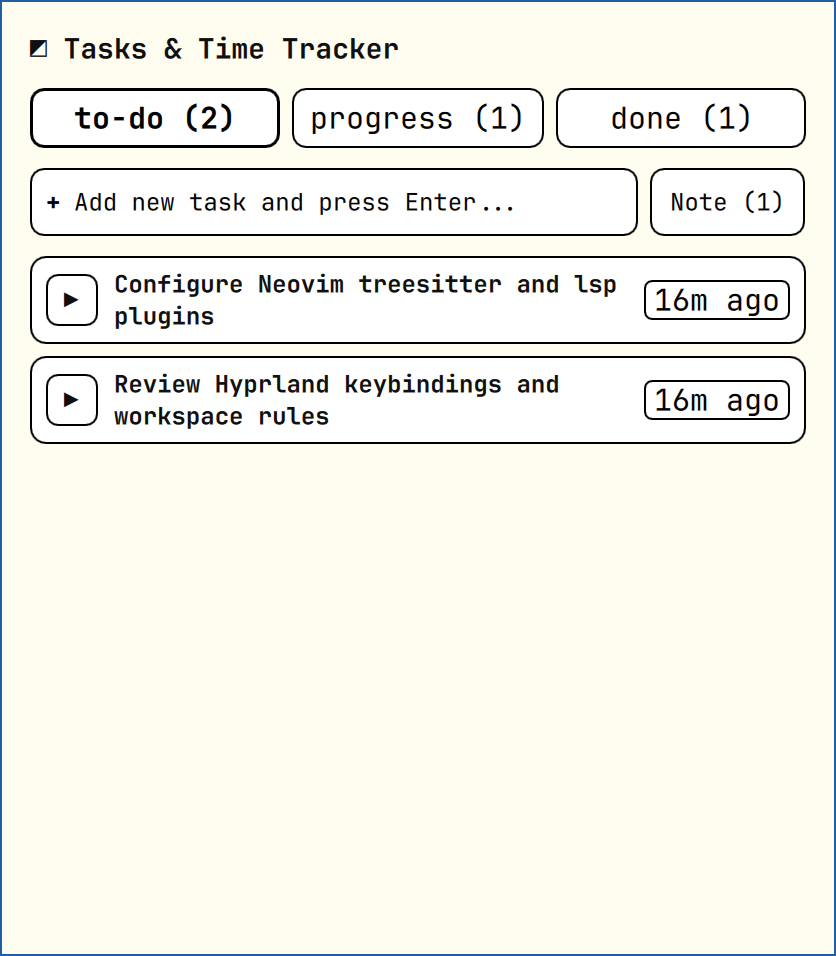
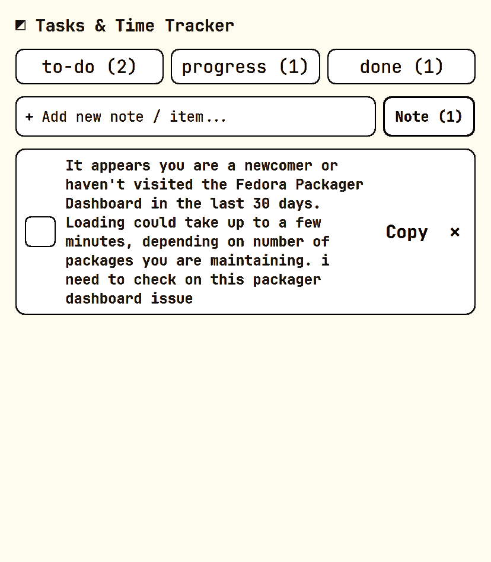

# ◩ Tasks & Time Tracker

A native [Omarchy](https://omarchy.org/) bar plugin for task management, live stopwatch tracking, and Markdown notes.

<p align="center">
  
  
</p>

## Features

- **3-Stage Workflow**: `to-do`, `progress` (live stopwatch), and `done` (total time spent).
- **Markdown Notes**: Fast scratchpad with interactive checkboxes and one-click copy.
- **Smart Hover**: Contextual actions (`▶`, `⏸`, `✓`, `↺`, `Copy`, `✕`) reveal on hover.
- **Theme Adaptive**: Automatically matches your active Omarchy color scheme and typography.
- **Zero Overhead**: Native in-process Quickshell layer with persistent storage in `~/.local/share/to-do/`.

## Install

The recommended way to install and enable the plugin:
```bash
omarchy plugin add https://github.com/sheikhlimon/omarchy-todo.git --enable
```

*(For manual installation: clone this repository to `~/.config/omarchy/plugins/limon.todo` and add `"limon.todo"` to `~/.config/omarchy/shell.json`).*

## Uninstall

To cleanly remove the plugin and disable it from your shell:
```bash
omarchy plugin remove limon.todo
```

*(For manual uninstallation: remove `"limon.todo"` from your `~/.config/omarchy/shell.json` and delete the `~/.config/omarchy/plugins/limon.todo` directory).*

## License

[MIT](LICENSE)
